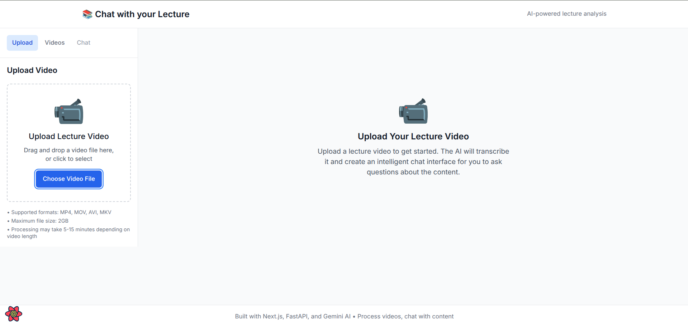
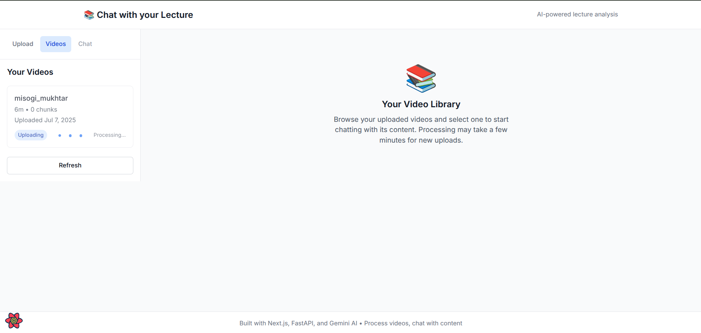
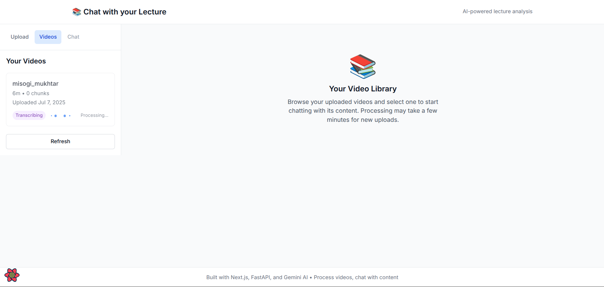
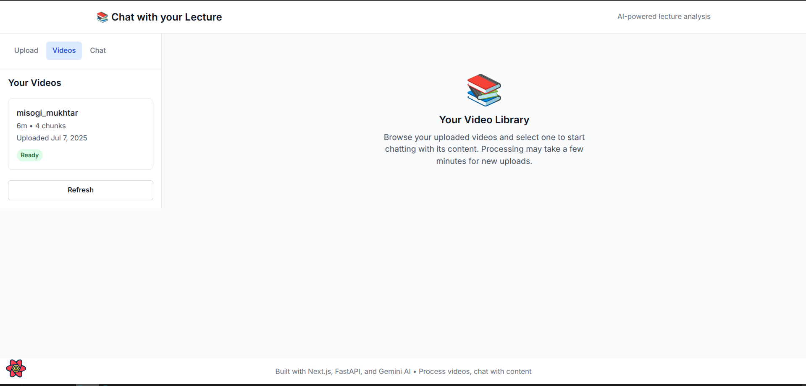
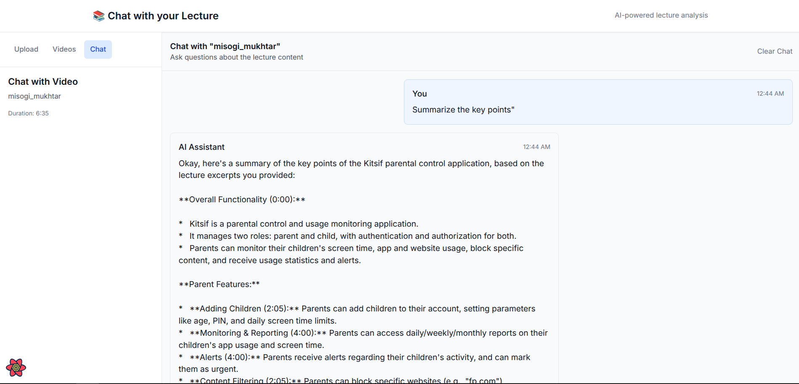

# Chat with your Lecture - Video RAG Application

A comprehensive application that processes lecture videos, generates transcripts, and enables natural language conversations with lecture content using RAG (Retrieval-Augmented Generation) architecture.







## Features

- **Video Upload**: Support for 2-3 hour lecture video uploads
- **Automated Transcription**: Speech-to-text conversion using Whisper
- **RAG Pipeline**: Intelligent chunking and vector embedding of transcripts
- **Interactive Chat**: Natural language Q&A with lecture content
- **Timestamp Navigation**: Responses linked to specific video moments
- **Context-Aware**: Understands lecture context for accurate responses

## Architecture

### Frontend (Next.js)

- Video upload interface
- Interactive chat component
- Video player with timestamp navigation
- Modern, responsive UI

### Backend (FastAPI)

- Video processing pipeline
- RAG implementation with vector storage
- AI-powered response generation using Gemini 2.5 Pro
- RESTful API endpoints

## Tech Stack

- **Frontend**: Next.js, React, TypeScript, Tailwind CSS
- **Backend**: FastAPI, Python 3, ChromaDB
- **AI/ML**: OpenAI Whisper, Gemini 2.5 Pro, Vector Embeddings
- **Storage**: Local file system, Vector database

## Installation

### Prerequisites

- Node.js 18+ with pnpm
- Python 3.8+ with venv
- FFmpeg for video processing

### Setup

1. **Clone the repository**

   ```bash
   git clone <repository-url>
   cd Chat-with-your-Lecture
   ```

2. **Backend Setup**

   ```bash
   cd backend
   python3 -m venv venv
   source venv/bin/activate
   pip install -r requirements.txt
   ```

3. **Frontend Setup**

   ```bash
   cd frontend
   pnpm install
   ```

4. **Environment Configuration**
   - Copy `.env.example` to `.env` in both frontend and backend
   - Add your API keys (Gemini, OpenAI if needed)

## Usage

1. **Start Backend**

   ```bash
   cd backend
   source venv/bin/activate
   uvicorn app.main:app --reload --host 0.0.0.0 --port 8000
   ```

2. **Start Frontend**

   ```bash
   cd frontend
   pnpm dev
   ```

3. **Access Application**
   - Open http://localhost:3000
   - Upload a lecture video
   - Wait for processing to complete
   - Start chatting with your lecture content!

## Sample Use Cases

- "What did the professor say about machine learning algorithms?"
- "Explain the concept discussed around minute 45"
- "Summarize the key points from the first hour"
- "What examples were given for neural networks?"

## API Documentation

Once running, visit http://localhost:8000/docs for interactive API documentation.

## Contributing

1. Fork the repository
2. Create a feature branch
3. Make your changes
4. Add tests if applicable
5. Submit a pull request

## License

MIT License
